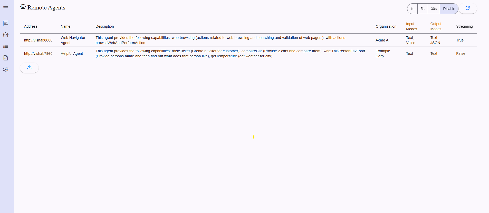

# Google A2A (Agent to Agent) Protocol with Selenium

This project demonstrates the integration of Google's A2A (Agent to Agent) protocol with Selenium for automated web browsing, test validation, screen capture, and other web-related tasks. The implementation provides flexible deployment options and powerful multi-agent workflow capabilities.  
**A2AJava is the Java implementation** of the Google A2A protocol you can check the project [here](https://github.com/vishalmysore/a2ajava) . 


## Features

- Web automation using Selenium WebDriver
- Flexible deployment modes:
  - Local A2A task execution
  - Remote 8-Way server integration
- Screenshot capture and validation
- Multi-agent workflow support
- Integration with other agents (e.g., Kafka, lock capture)

## Architecture

The system is built using Spring Boot and follows a modular architecture:



### Components

1. **Web Browsing Agent**: Handles Selenium-based web automation
2. **Agent Card Controller**: Manages agent capabilities and real-time communication
3. **Selenium A2A Controller**: Processes JSON-RPC requests for web automation
4. **Task Management**: Supports both local and remote task execution

## Getting Started

### Prerequisites

- Java 18 or higher
- Maven
- Chrome/Chromium browser

### Installation

1. Clone the repository
2. Install dependencies:
```bash
mvn install
```

### Configuration

Configure the application using `tools4ai.properties`:

```properties
##Gemini related settings
gemini.modelName=gemini-2.0-flash-001
gemini.location=us-central1
gemini.projectId=cookgptserver

##Anthropic related settings
anthropic.modelName=claude-3-haiku-20240307
```

## Usage

### Local Task Execution

Create a web action file (`web.action`):

```action
go to website https://the-internet.herokuapp.com
click on A/B Testing
save screenshot as "the-internet.herokuapp.com.png"
```

Run the agent:

```java
LocalA2ATaskClient client = context.getBean(LocalA2ATaskClient.class);
FilePart filePart = new FilePart();
// ... setup file content
Task t = client.sendFileTask(filePart);
```

### Task Management

Monitor task execution through the web interface:


### Real-time Communication

The system supports real-time updates through WebSocket:


## Event Flow

The following diagram illustrates the event flow in the system:


## Local Task Execution

Example of local task execution:


## Sample Test Results

Here are sample test execution results:


## Contributing

Contributions are welcome! Please feel free to submit a Pull Request. For major changes, please open an issue first to discuss what you would like to change.

## License

This project is licensed under the MIT License - see the [LICENSE](LICENSE) file for details.

## Support

For questions and support, please open an issue in the repository.


## Tool Calling

```json
{"method":"tools/call","params":{"name":"browseWebAndReturnImage","arguments":{"provideAllValuesInPlainEnglish":"Go to Google.com, search for \"a2ajava\", wait for results to load, click on the first search result link, wait for the page to load completely, then take a screenshot of the page"}},"jsonrpc":"2.0","id":17}
```


```json
{"method":"tools/call","params":{"name":"browseWebAndReturnText","arguments":{"provideAllValuesInPlainEnglish":"Go to Google.com, search for \"a2ajava\"give me result"}},"jsonrpc":"2.0","id":17}
```


