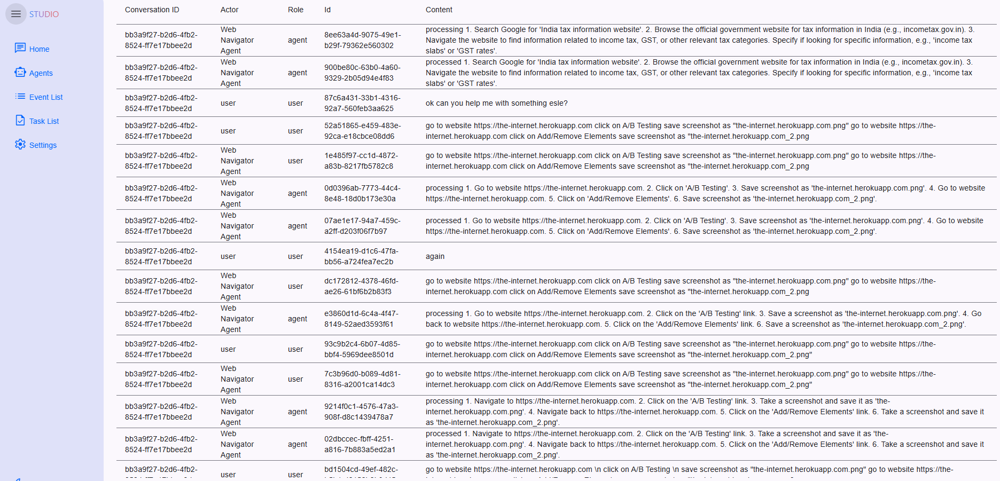
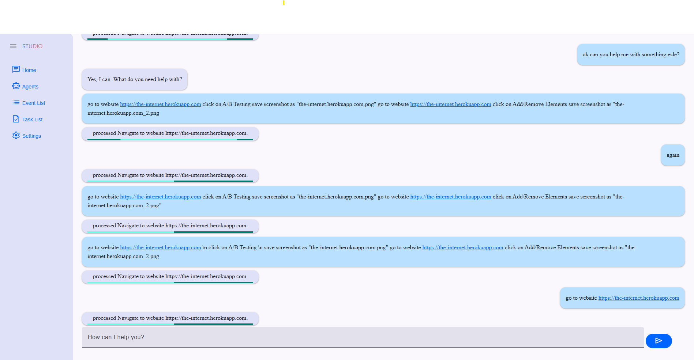

# A2A Protocol with Selenium: Revolutionizing Web Automation

The A2A (Agent to Agent) Protocol, implemented through the a2ajava library, brings a revolutionary approach to web automation and UI validation. By combining the power of A2A protocol with Selenium WebDriver, this implementation enables seamless communication between different agents while automating web interactions. The integration goes beyond traditional automation by allowing agents to collaborate, share context, and execute complex web automation tasks.

## Why A2A Protocol with Selenium?

1. **Agent-Based Architecture**: The A2A protocol enables multiple agents to work together, each specializing in different aspects of web automation.
2. **Natural Language Processing**: Through Tools4AI integration, agents can understand and execute commands written in plain English.
3. **Real-Time Communication**: Agents can communicate and share results in real-time through the A2A protocol.
4. **Flexible Deployment**: Supports both local execution and remote server deployment through 8-Way architecture.

## A2A Integration with Selenium

The a2ajava library provides a powerful integration with Selenium through its A2A protocol implementation. This integration allows for:

1. **Agent-Based Web Automation**: Create specialized agents for different web automation tasks
2. **Protocol-Based Communication**: Standardized communication between agents using the A2A protocol
3. **Natural Language Commands**: Support for plain English commands through Tools4AI integration

### Example: Web Automation with A2A Protocol

```java
@Agent(groupName = "web browsing", groupDescription = "actions related to web browsing and searching")
public class WebBrowsingAction {
    
    @Action(description = "perform actions on the web with selenium")
    public String browseWebAndPerformAction(String webBrowsingSteps) throws IOException {
        SeleniumScriptProcessor script = new SeleniumScriptProcessor();
        ScriptResult result = script.process(webBrowsingSteps, callback);
        return result.toString();
    }
}
```

### Using Web Action Files

Create a `web.action` file with natural language commands:

```action
go to website https://the-internet.herokuapp.com
click on A/B Testing
save screenshot as "the-internet.herokuapp.com.png"
go to website https://the-internet.herokuapp.com
click on Add/Remove Elements
save screenshot as "the-internet.herokuapp.com_2.png"
```

### Executing Web Actions through A2A Protocol

```java
// Initialize A2A client
LocalA2ATaskClient client = context.getBean(LocalA2ATaskClient.class);

// Create file task
FilePart filePart = new FilePart();
FileContent fileContent = new FileContent();
Path webActionPath = Paths.get("src/main/resources/web.action");
byte[] fileBytes = Files.readAllBytes(webActionPath);
String base64Content = java.util.Base64.getEncoder().encodeToString(fileBytes);

// Configure and send task
fileContent.setName("web.action");
fileContent.setMimeType("text/plain");
fileContent.setBytes(base64Content);
filePart.setFile(fileContent);
Task task = client.sendFileTask(filePart);
In this example, the SeleniumProcessor processes commands in plain English and converts them into Selenium actions. 

Code for above example is here
This approach allows for complex interactions without manually writing Java code for each test. Tools4AI serves as a bridge between natural language and Selenium, making it easier to automate UI testing in a way that is both efficient and intuitive.

## A2A Protocol Screen Validations

The A2A protocol, combined with Tools4AI's capabilities, provides a powerful way to validate screens and convert visual information into structured data. This integration enables agents to:

1. **Process Visual Information**: Convert screenshots and images into structured Java objects
2. **Share Visual Context**: Pass visual information between agents using the A2A protocol
3. **Validate UI States**: Automatically verify UI elements and their relationships

### A2A Protocol Features for Visual Processing

The A2A protocol enables sophisticated visual processing capabilities:

1. **Inter-Agent Visual Communication**: 
   - Agents can share and process visual information
   - Support for complex visual validation workflows
   - Real-time visual state synchronization

2. **Structured Data Extraction**:
   - Convert UI screenshots into Java objects
   - Process visual information through multiple specialized agents
   - Maintain visual context across different automation steps

3. **Protocol-Based Validation**:
   - Standard methods for visual information exchange
   - Built-in support for visual state validation
   - Integration with existing A2A workflows

Examples
Example 1

Article content
Sales of Chocolate
The above picture can be converted to Java object with simple code in this way

GeminiImageActionProcessor processor = new GeminiImageActionProcessor();
Sales sales = (Sales)processor.imageToPojo(GeminiImageExample.class.getClassLoader().getResource("images/sales.PNG"), Sales.class) 
The Sales pojo looks like this

@Getter
@Setter
@ToString
@NoArgsConstructor
public class Sales {

    @MapKeyType(Integer.class)
    @MapValueType(Double.class)
    Map<Integer,Double> yearlySales;
} 
If you dont want to create a Pojo you can get data in simple HashMap or Json String as well

 log.info(processor.imageToJson(GeminiImageExample.class.getClassLoader().getResource("images/sales.PNG"),"sales in 2013"));
and the response would be 

INFO: {"fields":[{"fieldName":"sales in 2013","fieldType":"String","fieldValue":"58"}]}
Or you can get multiple values in this way

log.info(processor.imageToJson(GeminiImageExample.class.getClassLoader().getResource("images/sales.PNG"),"sales in 2013", "sales in 2015"));
and your output will be 

INFO: {
  "fields": [
    {
      "fieldName": "sales in 2013",
      "fieldType": "String",
      "fieldValue": "58"
    },
    {
      "fieldName": "sales in 2015",
      "fieldType": "String",
      "fieldValue": "67"
    }
  ]
}
Example 2

Article content
We will convert this Pojo into Java code 

FoodConsumption foodConsume = (FoodConsumption) processor.imageToPojo(GeminiImageExample.class.getClassLoader().getResource("images/PieChart.PNG"), FoodConsumption.class);
log.info(foodConsume.toString());
FoodConsumption Pojo looks like this

@Getter
@Setter
@NoArgsConstructor
@ToString
public class FoodConsumption {
    @MapValueType(Double.class)
    @MapKeyType(String.class)
    private Map<String, Double> foodTypeToPercentage;
}
Output looks like this

INFO: FoodConsumption(foodTypeToPercentage={Rice Dishes=0.3, Leafy Greens=0.15, Soups=0.25, Root Vegetables=0.2, Hot Drinks=0.1})
Example 3

Article content


log.info(processor.imageToPojo(GeminiImageExample.class.getClassLoader().getResource("images/FruitsSold.PNG"), WeeklyFruitSales.class).toString());
and our pojo looks like this

@Getter
@Setter
@NoArgsConstructor
@ToString
public class WeeklyFruitSales {
    @ListType(DailyFruitSales.class)
    private List<DailyFruitSales> dailySales;

    // Constructor
    public WeeklyFruitSales(List<DailyFruitSales> dailySales) {
        this.dailySales = dailySales;
    }

    // Getter and Setter
    public List<DailyFruitSales> getDailySales() {
        return dailySales;
    }

    public void setDailySales(List<DailyFruitSales> dailySales) {
        this.dailySales = dailySales;
    }
}
and output is 

INFO: WeeklyFruitSales(dailySales=[DailyFruitSales(dayOfWeek=Monday, fruitSales={Mango=12, Orange=10, Banana=5}), DailyFruitSales(dayOfWeek=Tuesday, fruitSales={Mango=15, Orange=13, Banana=6}), DailyFruitSales(dayOfWeek=Wednesday, fruitSales={Mango=7, Orange=9, Banana=6}), DailyFruitSales(dayOfWeek=Thursday, fruitSales={Mango=6, Orange=14, Banana=5}), DailyFruitSales(dayOfWeek=Friday, fruitSales={Mango=19, Orange=17, Banana=8}), DailyFruitSales(dayOfWeek=Saturday, fruitSales={Mango=19, Orange=21, Banana=10}), DailyFruitSales(dayOfWeek=Sunday, fruitSales={Mango=15, Orange=21, Banana=9})])
Example 4

Imagine you're testing an online library system, and you encounter a complex user interface with various elements representing different sections, like books, members, and other UI components. Traditionally, you would inspect each element individually to validate its content and functionality. This involves identifying and interacting with each UI element separately, which can be time-consuming and error-prone.

Tools4AI transforms this process by offering a unique feature that converts an entire screen or webpage into a Plain Old Java Object (POJO). This powerful capability enables you to extract the structure and content of a complex UI in one step, significantly streamlining the testing process

Article content


The POJOS look like this

@Setter
@Getter
@NoArgsConstructor
@ToString
public class LibraryScreen {
    @ListType(Book.class)
    private List<Book> latestBooks;
    @ListType(Member.class)
    private List<Member> members;
}
@Setter
@Getter
@NoArgsConstructor
@ToString
public class Book {
    private String title;
    private String author;
    private String genre;
    private boolean isAvailable;
    // Constructors, getters, and setters
}
 @Setter
@Getter
@NoArgsConstructor
@ToString
public class Member {
    private String id;
    private String name;
    @Prompt(dateFormat = "ddMMyyyy")
    private Date membershipStart;
    private int booksLoaned;
    // Constructors, getters, and setters
}
Please pay special attention to  @Prompt(dateFormat = "ddMMyyyy") as this will convert the date to the specified format automatically 

Since this is a complex screen we can use Transformer

String text = processor.imageToText(GeminiImageExample.class.getClassLoader().getResource("images/library.PNG"),"convert the entire screen to text");

GeminiV2PromptTransformer transformer = new GeminiV2PromptTransformer();

log.info(transformer.transformIntoPojo(text, LibraryScreen.class).toString());
and the entire screen will be converted to POJO

INFO: LibraryScreen(latestBooks=[Book(title=The Great Gatsby, author=F. Scott Fitzgerald, genre=Fiction, isAvailable=true), Book(title=1984, author=George Orwell, genre=Dystopian, isAvailable=false)], members=[Member(id=001, name=Alice Smith, membershipStart=Thu Jan 12 00:00:00 EST 2023, booksLoaned=4), Member(id=002, name=Bob Johnson, membershipStart=Wed Feb 15 00:00:00 EST 2023, booksLoaned=2)])
Example 5

Article content
String jsonStr = processor.imageToJson(GeminiImageExample.class.getClassLoader().getResource("images/auto.PNG"),"Full Inspection");
        log.info(jsonStr);
and the result is

INFO: {
  "fields": [
    {
      "fieldName": "Full Inspection",
      "fieldType": "String",
      "fieldValue": "Starting at $99.99"
    }
  ]
}
Or it can be converted into Pojo like this

@Getter
@Setter
@ToString
@NoArgsConstructor
@AllArgsConstructor
public class AutoRepairScreen {
    double fullInspectionValue;
    double tireRotationValue;
    double oilChangeValue;
    Integer phoneNumber;
    String email;
    String[] customerReviews;

}
Example 6

Imagine encountering the project report screen shown in the image you uploaded. Tools4AI can transform this screen into a Java object, allowing you to interact with its data in a structured manner for further analysis or testing.

Article content
We will convert this entire project report to POJO so that we can take action 

@NoArgsConstructor
@AllArgsConstructor
@Getter
@Setter
@EqualsAndHashCode
@ToString
public class ProjectDashboard {
    @MapKeyType(String.class)
    @MapValueType(Double.class)
    private Map<String, Double> featuresImplemented; // Map of quarter to percentage
    @MapKeyType(String.class)
    @MapValueType(Double.class)
    private Map<String, Double> expenses; // Map of quarter to percentage
    @ListType(ProjectStatus.class)
    private List<ProjectStatus> projectStatuses; // List of project status entries
    @ListType(Task.class)
    private List<Task> tasks; // List of tasks
    @ListType(String.class)
    private List<String> criticalItems; // List of critical items
    @ListType(String.class)
    private List<String> blockers;
}
@NoArgsConstructor
@AllArgsConstructor
@Getter
@Setter
@EqualsAndHashCode
@ToString
public class Task {
    private String assignedTo;
    private String priority;
    private String status;
    private int completion;
}
@NoArgsConstructor
@AllArgsConstructor
@Getter
@Setter
@EqualsAndHashCode
@ToString
public class ProjectStatus {
    private String projectName;
    @MapKeyType(String.class)
    @MapValueType(Integer.class)
    private Map<String, Integer> statusCounts;
}


and then we call our image processor 

GeminiImageActionProcessor processor = new GeminiImageActionProcessor();
ProjectDashboard projectDashboard = (ProjectDashboard) processor.imageToPojo(GeminiImageExample.class.getClassLoader().getResource("images/RAG.PNG"), ProjectDashboard.class);
log.info(projectDashboard.toString());
and here is the result

INFO: ProjectDashboard(featuresImplemented={1st Qtr=64.0, 3rd Qtr=11.0, 2nd Qtr=25.0}, expenses={1st Qtr=25.0, 3rd Qtr=40.0, 2nd Qtr=35.0}, projectStatuses=[ProjectStatus(projectName=Neo, statusCounts={Issues=3, Features=2, Backlog=4}), ProjectStatus(projectName=Wypal, statusCounts={Issues=3, Features=1, Backlog=2}), ProjectStatus(projectName=Dorake, statusCounts={Issues=1, Features=3, Backlog=2}), ProjectStatus(projectName=Symphony, statusCounts={Issues=2, Features=3, Backlog=1})], tasks=[Task(assignedTo=John, priority=High, status=Done, completion=100), Task(assignedTo=Smith, priority=Normal, status=In progress, completion=20), Task(assignedTo=Zoya, priority=Low, status=Not started, completion=0), Task(assignedTo=Ellie, priority=High, status=In progress, completion=40)], criticalItems=[Order more RAM], blockers=[Server Upgrades, Core Processors])
## A2A Protocol Architecture

The A2A protocol implementation in this project follows a multi-agent architecture:


### Components

1. **Web Browsing Agent (`WebBrowsingAction`)**: 
   - Handles Selenium-based web automation
   - Processes natural language commands
   - Captures and processes screenshots

2. **Agent Card Controller (`AgentCardController`)**:
   - Manages agent capabilities
   - Handles real-time communication
   - Provides agent discovery services

3. **A2A Controller (`SeleniumA2AController`)**:
   - Processes JSON-RPC requests
   - Manages agent communication
   - Handles task distribution

### Task Flow



1. Tasks are submitted through the A2A protocol
2. Agents process tasks according to their capabilities
3. Results are shared through protocol-defined channels

## Real-Time Communication

The A2A protocol enables real-time communication between agents:



### Task Management

Tasks are tracked and managed through the A2A protocol:


## Conclusion

The A2A protocol, implemented through a2ajava, provides a robust framework for web automation and testing. By combining protocol-based communication with Selenium's web automation capabilities, this implementation enables:

1. **Scalable Automation**: Multiple agents working together through standardized protocols
2. **Flexible Integration**: Easy integration with existing automation frameworks
3. **Real-Time Processing**: Immediate response to web automation tasks
4. **Visual Processing**: Sophisticated handling of visual information
5. **Protocol-Based Communication**: Standardized methods for agent interaction

This implementation demonstrates the power of combining the A2A protocol with web automation tools, creating a flexible and powerful system for modern web testing and automation needs.